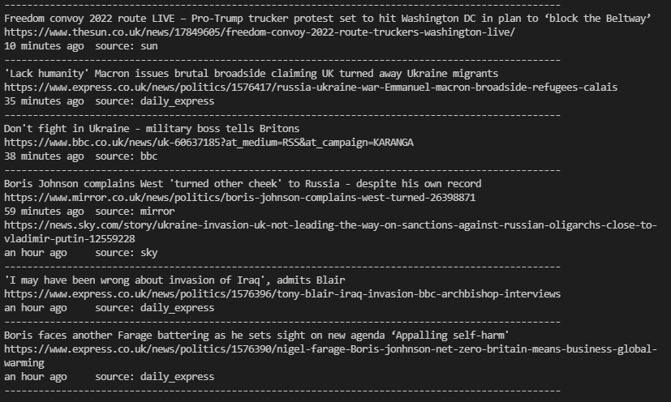
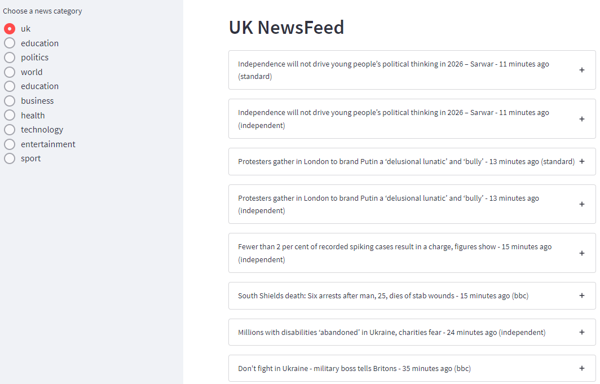
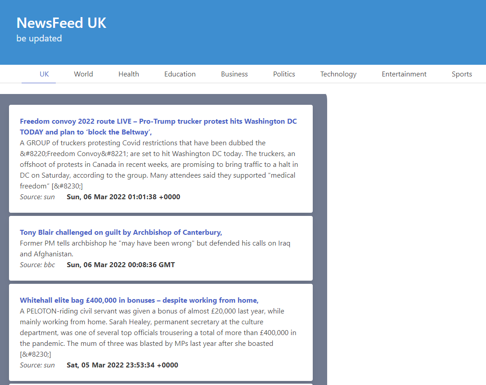

# news-scrape
This app scans Top UK news sites and returns latest headline news items. There are three deployment options, A CLI, and two web apps using two web apps - using streamlit and flask

### Built With
* [typer](https://pypi.org/project/typer/)
* [streamlit](https://pypi.org/project/streamlit/)
* [Flask](https://pypi.org/project/Flask/)

## Screenshots
### 1. CLI

### 2. STREAMLIT

### 2. FLASK (still in development)

