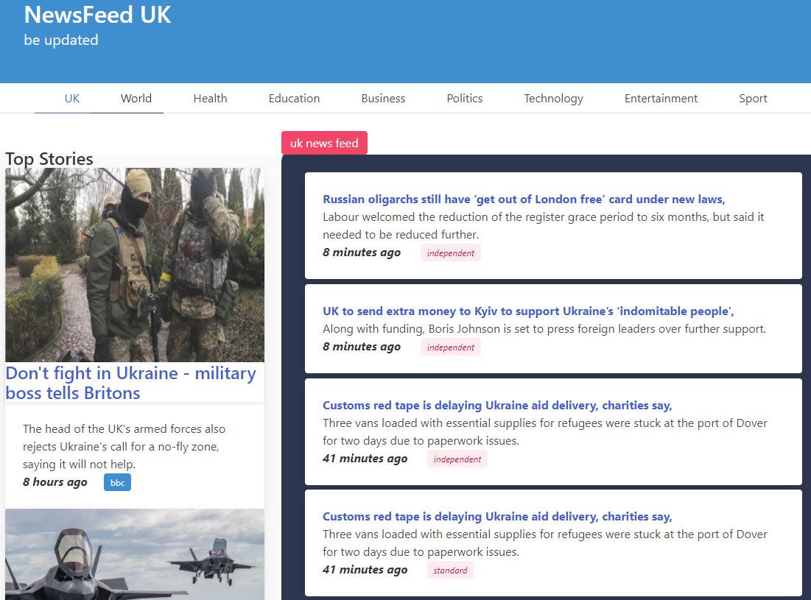

# news-scrape
This app scans Top UK news sites and returns latest headline news items. There are three deployment options, A CLI, and two web apps using two web apps - using streamlit and flask

### Built With
* [typer](https://pypi.org/project/typer/)
* [streamlit](https://pypi.org/project/streamlit/)
* [Flask](https://pypi.org/project/Flask/)


## Screenshots
### 1. CLI


### 2. STREAMLIT


### 2. FLASK (still in development)



### How To Use the CLI

To clone and run this application, you'll need [Git](https://git-scm.com) installed on your computer. From your command line

```bash
# Clone this repository
$ git clone https://github.com/ubongab/news-scrape

# Go into the repository
$ cd news-scrape

# Install dependencies
$ pip install typer
$ pip install feedparser
$ pip install arrow
$ pip install pandas 

# Run the app
$ python cli-app.py technology

# By default, 10 news items are displayed, to change the number of items:
$ python cli-app.py technology 15
```

### TO DO
* Remove dependency - pandas
* Function doc strings
